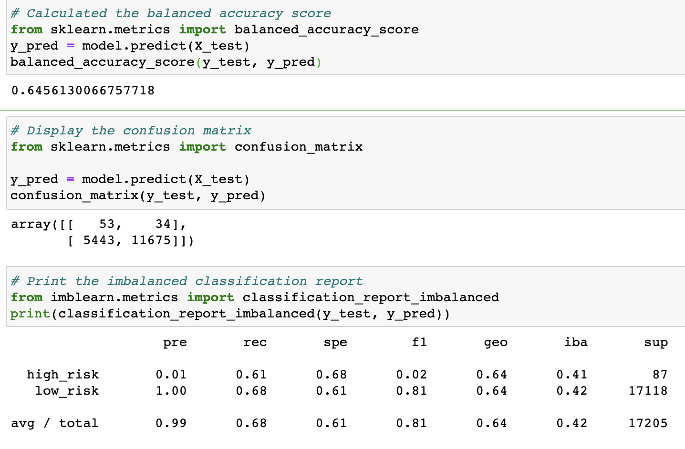
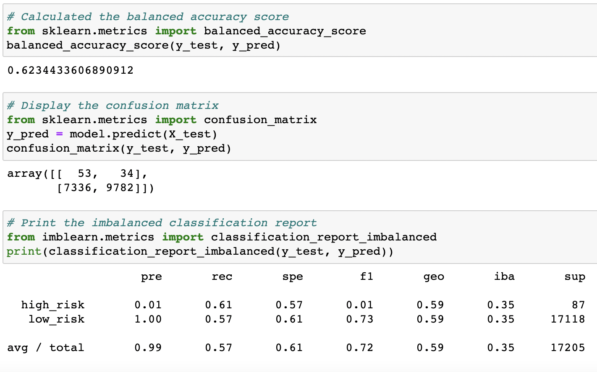
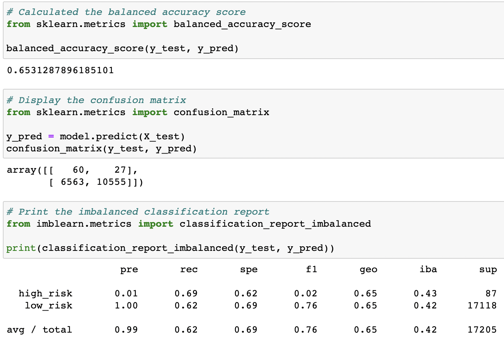
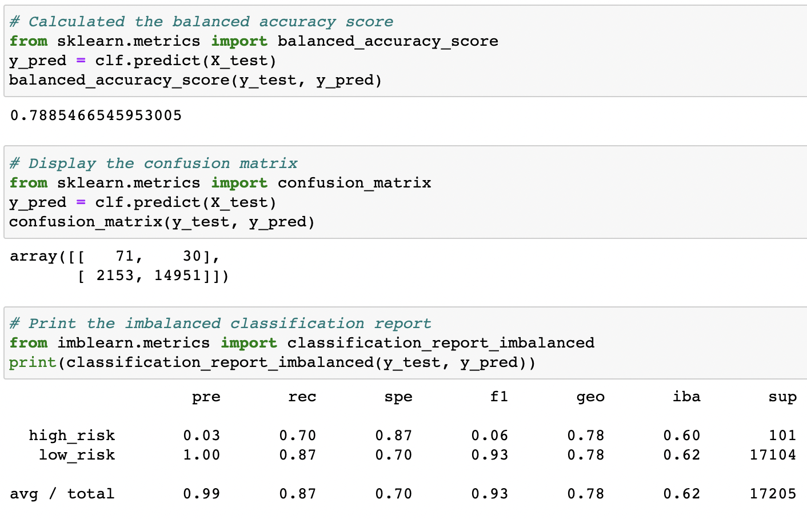
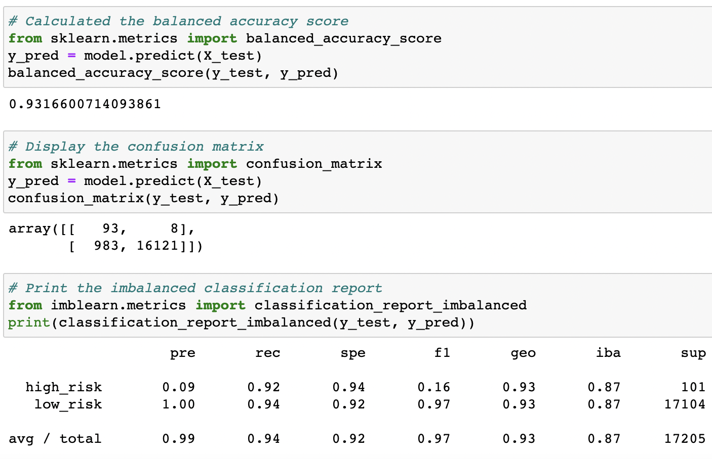

# Credit_Risk_Analysis
## Overview of Analysis
The purpose of this analysis was to employ different techniques to train, build, and evaluate models with unbalanced classes using imbalanced-learn and scikit-learn libraries and applying resampling techniques to credit card data from LendingClub (a peer-to-peer lending services company). Credit risk data is the perfect dataset for this analysis because it is an inherently unbalanced classification problem as good loans easily outnumber risky loans.

## Results
Random Oversampler Results

SMOTE Oversampler Results

Cluster Centroids Results

SMOTEEN Combination Results

Balanced Random Forest Results

Easy Ensemble Results

Based on the data shown above the Easy Ensemble AdaBoost classifier had the highest accuracy score of approximately 92%. On the other hand, the SMOTEENN over and under sampling algorithm had the lowest accuracy score of approximately 59%. We learn the following regarding precision for the 6 algorithms used in this analysis based on the confusion matrices where Precision = TP/(TP + FP):

- the randomOversampler algorithm has precision of 53/5443 = 0.0097
- the SMOTE Oversampler algorithm has precision of 53/6202 = 0.0085
- the cluster centroids algorithm has precision of 53/7336 = 0.0072
- the SMOTEENN combination algorithm has precision of 60/6563 = 0.0091
- the Balanced Random Forest Classifier has precision of 71/2153 = 0.032
- the Easy Ensemble AdaBoost has precision of 93/983 = 0.0946

Clearly the Easy Ensemble Learner algorithm has the best precision and the Balanced Random Forest Classifier had the second best precision.

## Summary
Based on the results from the machine learning models I would recommend the Easy Ensemble AdaBoost algorithm be used as it has the best accuracy and precision. Both accuracy and precision are important when assessing credit risk 
